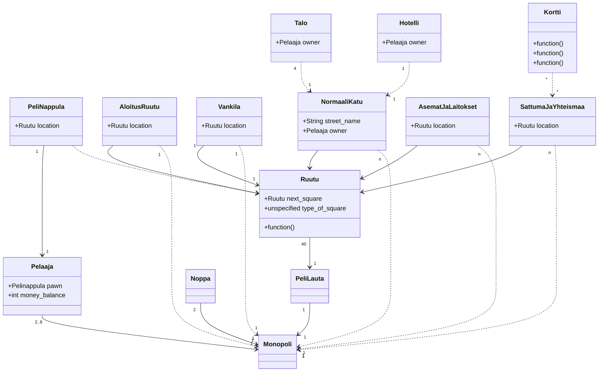

# Monopoli luokkakaavio
  
## Tehtävä 1 & 2
 

```mermaid
  classDiagram
    class Monopoli {
    }
    
    class Pelaaja {
    +Pelinappula pawn
    +int money_balance
    }
    
    class PeliNappula {
      +Ruutu location
    }
    
    class PeliLauta {
    }
    
    class Ruutu {
      +Ruutu next_square
      +unspecified type_of_square
      +function()
    }
    
    class Noppa {
    }
    
    class AloitusRuutu {
      +Ruutu location
    }
    
    class Vankila {
      +Ruutu location
    }
    
    class SattumaJaYhteismaa {
      +Ruutu location
    }
    
    class AsematJaLaitokset {
      +Ruutu location
    }
    
    class NormaaliKatu {
      +String street_name
      +Pelaaja owner
    }  
    
    class Talo {
    +Pelaaja owner
    }
    
    class Hotelli {
    +Pelaaja owner
    }
    
    class Kortti {
    +function()
    +function()
    +function()
    }
    
    PeliNappula ..> Ruutu
    Pelaaja "2..8" --> "1" Monopoli
    PeliLauta "1" --> "1" Monopoli
    Ruutu "40" --> "1" PeliLauta
    PeliNappula "1" --> "1" Pelaaja
    Noppa "2" --> "1" Monopoli
    Vankila "1" ..> "1" Monopoli
    AloitusRuutu "1" ..> "1" Monopoli
    SattumaJaYhteismaa "n" ..> "1" Monopoli
    AsematJaLaitokset "n" ..> "1" Monopoli
    NormaaliKatu "n" ..> "1" Monopoli
    Vankila "1" --> "1" Ruutu
    AloitusRuutu --> Ruutu
    SattumaJaYhteismaa --> Ruutu
    AsematJaLaitokset --> Ruutu
    NormaaliKatu --> Ruutu
    Hotelli "1" ..> "1" NormaaliKatu
    Talo "4" ..> "1" NormaaliKatu
    Kortti "*" ..> "*" SattumaJaYhteismaa 
    
```
