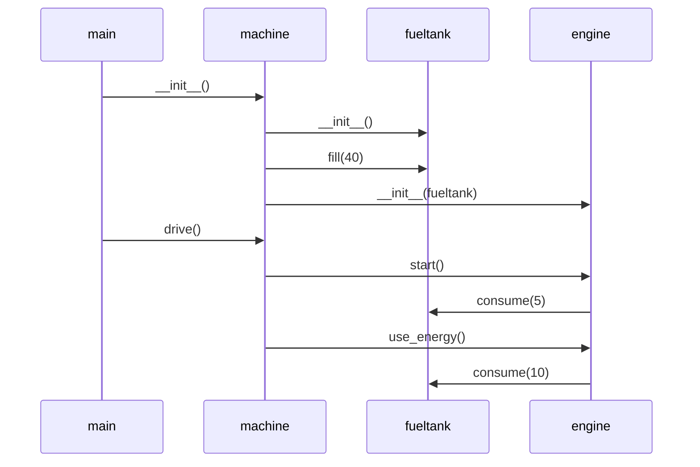

# Tehtävä 3
    

```mermaid
  sequenceDiagram
    main->>machine: __init__()
    
    machine->>fueltank: __init__()
    machine->>fueltank: fill(40)
    machine->>engine: __init__(fueltank)
    
    main->>machine: drive()
    machine->>engine: start()
    engine->>fueltank: consume(5)
    machine->>engine: use_energy()
    engine->>fueltank: consume(10)
    
  
```
