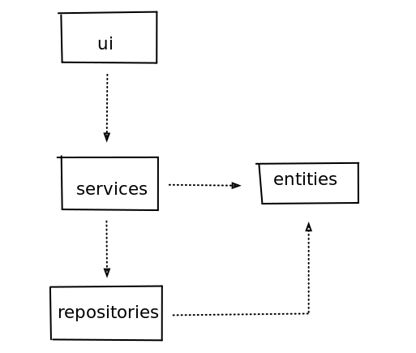
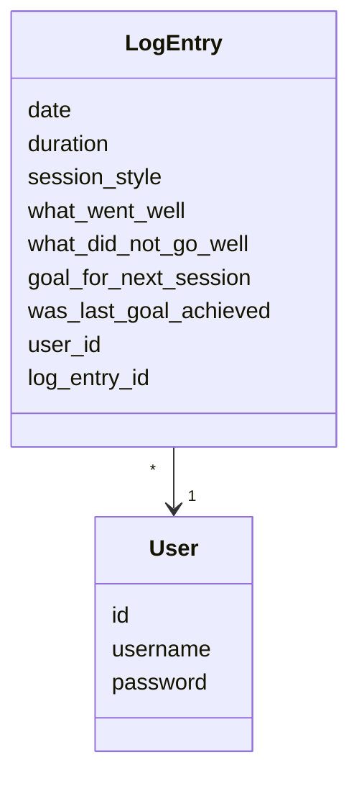
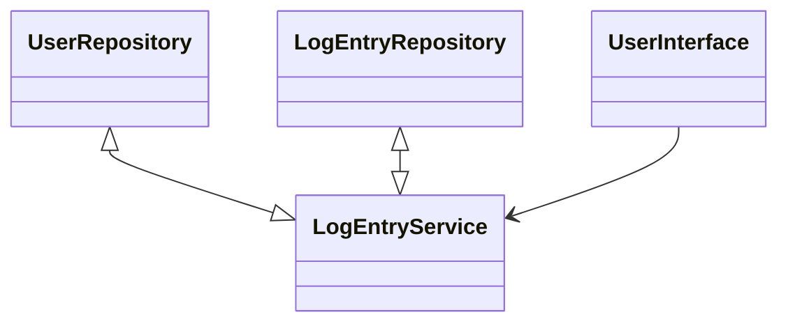
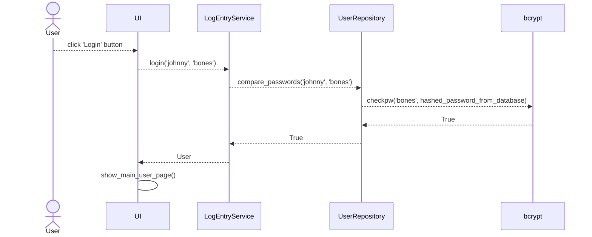
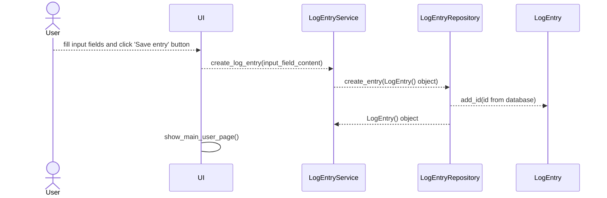

# Program architecture, logic and user interface

## User interface
The user interface has **6** different pages.
- Login page
- Create new user page
- User's main page
- New log entry page
- Browse log entries page
- Statistics page

Each page is it's own class and user can view one page at a time. The class responsible for controlling the viewing of pages is the _UI_ class. The user interface can **only** access methods by class _LogEntryService_ and has been tried to keep separate from application logic though in some cases it does some very simple data manipulation in order to have more general _LogEntryService_ methods.

## Architecture
The program's architecture follows the three-tier architecture model. The layer structure is the following:

Layer _ui_ has the code responsible for the user interface,
 _services_ has the code responsible for application logic and
 _repositories_ has the code responsible for data persistence mechanisms and data access.
Layer _entities_ has the code responsible for describing application's data models.  

## Logic
The classes that create the logical data model of the program are [User](https://github.com/jooniku/ohjelmistotekniikka_23/tree/master/training_log_app/src/entities/user.py) and [LogEntry](https://github.com/jooniku/ohjelmistotekniikka_23/tree/master/training_log_app/src/entities/log_entry.py), which describe users and log entries made by users.

## Functional entities
The class responsible for functional entities is [LogEntryService](https://github.com/jooniku/ohjelmistotekniikka_23/blob/master/training_log_app/src/services/log_entry_service.py). The class offers service for all user interface actions such as login, create new user etc.

The class _LogEntryService_ has access to users and their log entries through their repositories [LogEntryRepository](https://github.com/jooniku/ohjelmistotekniikka_23/blob/master/training_log_app/src/repositories/log_entry_repository.py) and [UserRepository](https://github.com/jooniku/ohjelmistotekniikka_23/blob/master/training_log_app/src/repositories/user_repository.py) such that the repositories handle saving and retrieving the data and passes it to _LogEntryService_.

The user interface accesses _LogEntryService_ only. 

## Data persistence
From the layer _repositories_, the classes _LogEntryRepository_ and _UserRepository_ are responsible for storing data in an SQLite-database. The classes follow data access object (DAO) models and are the only connection with the database.

### Data files
The program saves all data to one database. The name and path of the database file is defined in the _**.env**_ file in the _**./training_log_app/**_ directory.

The database has **2** tables: Log_entries and Users.

The **Users** table is structured like so:
- id _**integer**_
- username _**string**_
- password _**hashed string**_

The **Log_entries** table is structured like so:
- id       _**integer**_
- log_id    _**user specific log id**_
- user_id   _**integer**_
- date   _**saved in dd/mm/yyyy format**_
- duration  _**saved in minutes**_
- session_style _**string, user chooses from a list**_
- what_went_well _**string**_
- what_did_not_go_well   _**string**_
- goal_for_next_session  _**string**_
- was_last_goal_achieved  _**integer, 1(yes) or 0(no)**_

## Main functions
Sequence diagrams describing the logic behind a few main functions

### Logging user in
When in the _Login window_, once user types in correct username and password, the program's control proceeds like described here.

Python library _bcrypt_ is used to store and compare hashed and salted passwords.

### Creating a log entry
When in the _Create new log entry window_, user can create a new log entry. The program's control proceeds like so.

### Other functions
Same basic principles follow with all function. User interface calls _LogEntryService_ which calls the _repositories_ layer and then does calculations or other logic before handing the data to the user interface. The user interface might do some simple tweaking of how the data is displayed but it shouldn't do any major manipulation of data.
