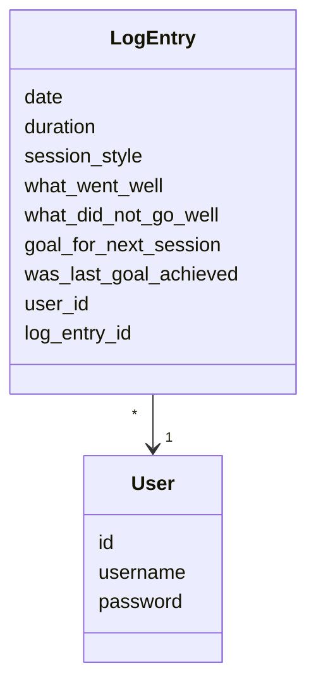
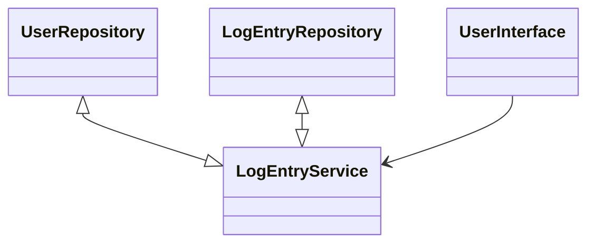

# Program architecture and Logic

## Logical data model
The classes that create the logical data model of the program are [User](https://github.com/jooniku/ohjelmistotekniikka_23/tree/master/training_log_app/src/entities/user.py) and [LogEntry](https://github.com/jooniku/ohjelmistotekniikka_23/tree/master/training_log_app/src/entities/log_entry.py), which describe users and log entries made by users.

## Functional entities
The class responsible for functional entities is [LogEntryService](https://github.com/jooniku/ohjelmistotekniikka_23/blob/master/training_log_app/src/services/log_entry_service.py). The class offers service for all user interface actions such as login, create new user etc.

The class _LogEntryService_ has access to users and their log entries through their repositories [LogEntryRepository](https://github.com/jooniku/ohjelmistotekniikka_23/blob/master/training_log_app/src/repositories/log_entry_repository.py) and [UserRepository](https://github.com/jooniku/ohjelmistotekniikka_23/blob/master/training_log_app/src/repositories/user_repository.py) such that the repositories handle saving and retrieving the data and passes it to _LogEntryService_.

