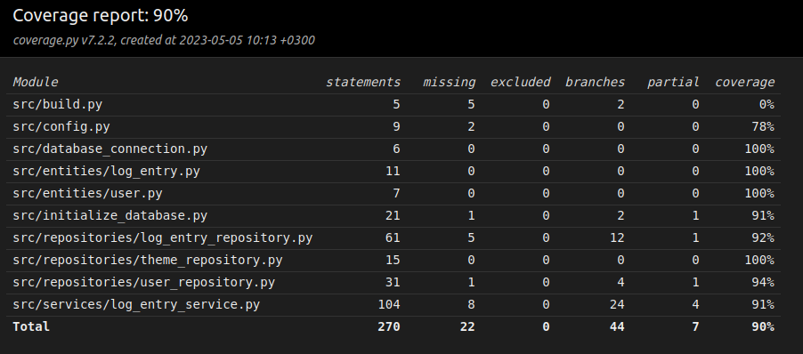

# Testing

The application has been tested using automatic unit and integration level testing with unittest. System testing has been done manually.

## Unit and integration testing

### Data persistence

The testing uses a database to store and retrieve data and check that it is done correctly. This database is configured in the __.env.test__ file and can also be changed like the main database shown in the .

### Application logic

The class responsible for application logic (_LogEntryService_) is tested with TestLogEntryService testclass. LogEntryService object is initialized in such way that LogEntryRepository and UserRepository objects are injected as dependencies to handle data persistence using the test-database.

### Repository classes

The repository classes LogEntryRepository, UserRepository and ThemeRepository are tested with the test-database. The classes responsible for testing are TestLogEntryRepository, TestUserRepository and TestThemeRepository.

### Test coverage

The user interface layer is not tested. The application has a test coverage of **90%**

Some methods in the LogEntryService class were not tested, since they just return a value from a repository class, which is tested.
Other files such as _build.py_ and _config.py_ were tested mainly manually.

Tests in cases where the application works completely incorrectly were not done, these are cases like fetching data without user being logged in, which should not be possible in any case.

## System testing

The system testing for the application was done manually.

### Installation and configuration

Application has been downloaded and tested like described in the . Different configurations in the file __.env__ have been used. 

### Functionalities

All of the functionalities in the  and user manual have been tested. Illegal and empty inputs have been tested for all fields.

## Remaining quality issues
- If the SQLite database has not been initialized with the command `poetry run invoke build`, the program will not show an error message
