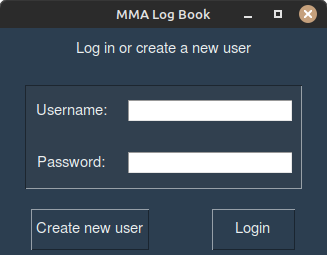
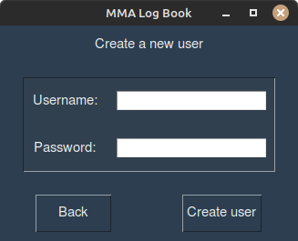
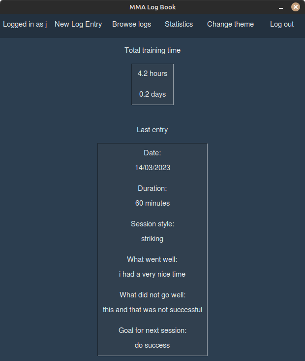

# User Manual

## Running the application

Before running the application the first time, go to the subdirectory __/training_log_app__ and install the necessary dependencies with the command:

```bash
poetry install
```
After this, you must initialize the database with the command:

```bash
poetry run invoke build
```

Now you can run the application with the command:

```bash
poetry run invoke start
```

## Logging in
The application start in the login page.



You can log in by writing an existing username and a corresponding password in the input field and clicking the "Login"-button.

If the login is successful, you are transferred to the user's main page.

## Creating a new user
You can create a new user by clicking the "Create new user"-button on the login page. 



To create a new user, write a username and a password to corresponding input fields and click the "Create user"-button.

_**Note:** Neither input can contain spaces._

If the creation is successful, you are prompted back to the login page to log in with the new account.

## Main page
This is the main page of the user. You are transferred here after login.



On the top left corner you'll see which user you're logged in as.

Here you can see your total training time in hours and days.

You can also see your latest entry if you have one. If you don't, you'll see an entry with "no data" as the fields.

You can go to several different pages from the main page.
- New Log Entry
- Browse logs
- Statistics

You can also **log out** by clicking the "Log out" button on the top right corner. Then you'll be transferred to the login page.

## Creating a new log entry
By clicking the "New Log Entry"-button on the main page, you can create a new entry.

![new_log_entry_page] __styling is unfinished so no photo yet__

There are several different input fields where you can write information. Here are the intended uses of them.

**Date:** selector pops up to choose the date of the session. Preset with current date. If given invalid input, it resets back to current day.

**Duration:** write in minutes the length of the session. _**Note:** This is a required field_

**Session style selector**: you can choose which style the session was from preset styles. This is done so statistics can be calculated about the session styles. If none is chosen, the preset of _select_ remains. This affects the statistics of session styles later described.

**What went well:** here you can write about what went well for the session. It is **not** required field.

**What did not go well:** here you can write about what didn't go well for the session or what you might want to improve upon. It is **not** a required field.

**Previously set goal:** here you can see the "goal for next session" entry for the previously added entry. 

**Was previously set goal achieved?:** you can choose from _yes_ or _no_, wheter you achieved the goal previously set. If none is chosen, it is interpreted as _no_.

**Goal for next session:** here you can write a goal to try to achieve for the next session. It is **not** a required field.

To save the entry, click the "Save entry"-button. You'll be redirected back to the main page.

You can also go back and discard the new entry by clicking the "Back"-button. Then you'll be redirected back to the main page.

## Browsing log entries
By clicking the "Browse logs"-button on the main page, you are directed to this page.

![browse_log_entries_page] __styling is unfinished so no photo yet__

Entries on this page are displayed in the same format as the one on the main page. Here you'll first see your last log entry. By clicking "Previous" and "Next" -buttons you can browse through the entries.

You can go back to the main page by clicking the "Back"-button.

## Viewing statistics
By clicking the "Statistics"-button on the main page, you'll be directed here.

Here you can see some statistics about your training sessions.

**Total training sessions:** This tells the total amount of sessions you have entered.

**Precentage of goals achieved:** This tells you the precentage of how many times you have achieved a previously set goal.

**Session styles ranked:** Here you can see the different styles ranked by how many sessions you have completed of them.

**Training sessions this:**
  - **Year:** Here you can see how many sessions you have completed this year.
  - **Month:** Here you can see how many sessions you have completed this month.
  - **Week:** Here you can see how many sessions you have completed this week.

**Graph of weekly training sessions this year:** shows a bar graph with amount of sessions on the y-axis and weeks on the x-axis. The whole graph represents current year. For example, if on week 15 you trained 4 times, then on x-axis 15 would have a bar with the height of 4.

You can go back to main page by clicking the "Back"-button.
