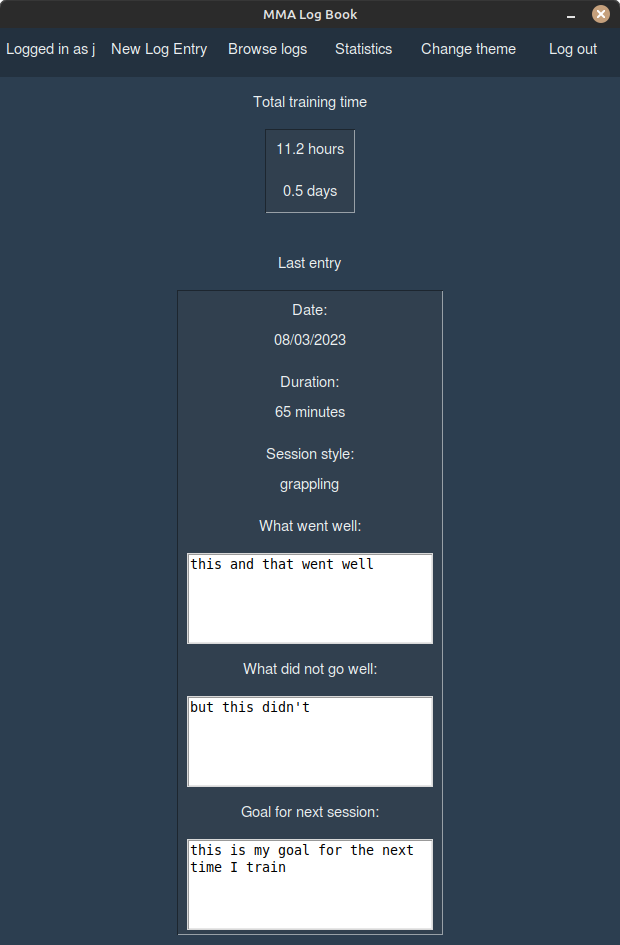

# User manual

## Running the application

Before running the application the first time, go to the subdirectory __/training_log_app__ and install the necessary dependencies with the command:

```bash
poetry install
```
After this, you must initialize the database with the command:

```bash
poetry run invoke build
```

Now you can run the application with the command:

```bash
poetry run invoke start
```

## Logging in
The application start in the login page.


You can log in by writing an existing username and a corresponding password in the input field and clicking the "Login"-button.

If the login is successful, you are transferred to the user's main page.

## Creating a new user
You can create a new user by clicking the "Create new user"-button. 


To create a new user, write a username and a password to corresponding input fields and click the "Create user"-button.

_**Note:** Neither input can contain spaces._

If the creation is successful, you are prompted back to the login page to log in with the new account.

## Main page
Here you can see your total training time in hours and in days.



On the top left corner you'll see which user you're logged in as.

You can also see your latest entry if you have one. If you don't, you'll see an entry with "no data" as the fields.

You can go to several different pages from the main page.
- New Log Entry
- Browse logs
- Statistics

You can also **log out** by clicking the "Log out" button on the top right corner. Then you're transferred to the login page.
